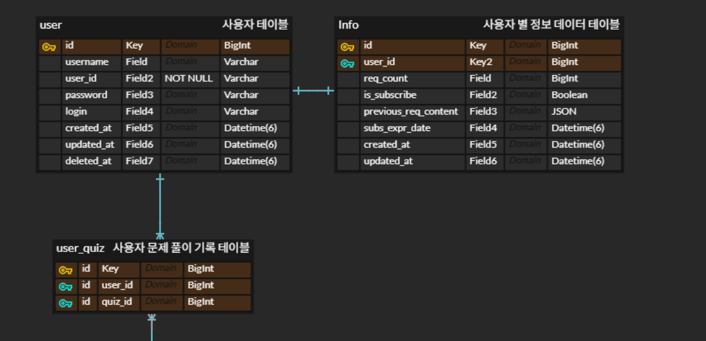

# 빈 4주차 과제


# **1️⃣ 성능을 고려한 연관관계 매핑 & 최적화 적용**


## **`@OneToMany` 컬렉션을 조회할 때 `List<MemberPrefer>`를 `Set<MemberPrefer>`로 변경 후 차이점 분석**

@OneToMany 컬렉션을 Set으로 변경 시 다음과 같은 변경점이 존재합니다.

1. 계속해서 삽입되는 데이터에 대해 
    - List 컬렉션은 중복을 허용합니다. 그렇기에
    - Set 컬렉션은 중복을 허용하지 않습니다.
2. 추가 어노테이션이나 설정이 없다는 전제 하에, 
    - List 컬렉션은 삽입 순서를 보장합니다.
    - Set 컬렉션은 삽입 순서를 보장하지 않습니다.
3. 데이터 또는 객체를 비교할 때, 
    - List 컬렉션은 메모리 주소를 기반으로 비교합니다.
    - Set 컬렉션은 추가적으로 구성된 equals(), hashCode() 메소드를 기반으로 비교합니다.

## **데이터 정합성을 고려하여 `orphanRemoval = true`가 필요한 곳 확인 후 적용**

**orphanRemoval = true?**

- JPA의 @OneToMany 어노테이션에서 사용하는 속성입니다.
- 부모 엔티티의 컬렉션에서 자식 엔티티가 제거될 경우, 해당 자식 엔티티를 고아로 간주 & 자동으로 데이터베이스에서 삭제하도록 설정합니다.
- 부모-자식 관계의 생명 주기를 부모가 전적으로 관리하도록 하여 데이터 정합성을 유지하는 데 필수적입니다.

**orphanRemoval = true가 필요한 곳** (Spring과 JPA을 주로 활용하므로, 해당 관점에서 바라보겠습니다.)

- orphanRemoval = true는 특정 부모 엔티티에 종속되어 부모 없이 존재해서는 안 되는 자식 엔티티에 적용해야 합니다.  = 자식 엔티티가 다른 부모와 공유되지 않고, 오직 하나의 부모에 의해 관리되는 경우에 적합합니다.
1. Post - (Comment, Picture). 게시판 서비스의 경우
    - 게시판에서 하나의 글이 지워진다면 해당 글에 딸린 댓글과 사용된 사진은 같이 지워져야 합니다.
    - 그렇기에 사진은 특정 게시글에만 종속되어야 합니다. 게시글에서 첨부파일을 제거하면 DB에서도 파일 메타 데이터가 삭제되어야 정합성이 유지됩니다.
2. Review - Review_photo, reply, UMC 워크북 프로젝트의 엔티티의 경우
    - 하나의 리뷰를 삭제하게 된다면, 해당 리뷰에 사용되었던 사진과, 리뷰에 대한 답글은 같이 지워져야 합니다.
    - 리뷰 사진과 답글은 특정 리뷰 내에서만 의미가 있으며, 리뷰를 취소하거나, 제거한 경우에 대해서는 해당 항목은 DB에서 사라져야 합니다.

# **2️⃣ 트랜잭션 & 동시성 이슈 처리**

## **하나의 트랜잭션에서 여러 엔티티를 처리하는 비즈니스 로직 작성**

[사이드 프로젝트 - 비즈니스 로직](https://github.com/DummyTalk-Solo-Project/DummyTalk_BE/commit/788bcce9b835bcd142f7816c57969d71bde947e5)


- 예) `Member`가 탈퇴할 경우 **관련된 모든 데이터를 삭제하는 API** 구현
- `@Transactional`을 적용하고, `@Modifying`을 활용하여 **Batch Delete 쿼리 최적화**

현재 제 사이드 프로젝트에서 엔티티의 연관관계는 다음 그림과 같습니다. 



그렇기에 @Modifying을 통한 Batch Delete 쿼리 작성 시 세 엔티티의 Repository 코드에 delete 메소드가 추가되어야 합니다.

또한 clearAutomatically = true 속성을 추가하여,  벌크 연산 후 영속성 컨텍스트를 자동 초기화로 DB의 변경 사항과 메모리 상의 엔티티 간의 데이터 불일치 문제를 2차적으로 방지하였습니다.

```java
@RestController
@Slf4j
@RequestMapping("/api/users")
@RequiredArgsConstructor
@Tag(name = "사용자 API", description = "사용자 관련 API 입니다")
public class UserController {
  @PatchMapping("/withdrawal")
    public ResponseEntity<Object> withdrawal (@AuthenticationPrincipal CustomUserDetails userDetails){
        userService.withdraw(userDetails.getUser().getEmail());
        return ResponseEntity.ok(null);
    }
}

```

```java
@Service @Slf4j @RequiredArgsConstructor
public class UserServiceImpl implements UserService {
    @Override
    @Transactional
    public void withdraw(String email) {

        // User와 관계된 엔티티 먼저 제거
        userQuizRepository.deleteByEmail(email);
        infoRepository.deleteByEmail(email);
        
        userRepository.deleteByEmail(email); // HARD DELETE!
    }
}
```

```java
public interface UserRepository extends JpaRepository<User,Integer> {
    @Modifying(clearAutomatically = true)
    @Query("DELETE FROM User u WHERE u.email = :email")
    void deleteByEmail(@Param("email") String email);
}

public interface InfoRepository extends JpaRepository<Info, Long> {
    @Modifying(clearAutomatically = true)
    @Query("DELETE FROM Info i WHERE i.user.email = :email")
    void deleteByEmail(@Param("email") String email);
}

public interface UserQuizRepository extends JpaRepository<UserQuiz, Long> {
    @Modifying(clearAutomatically = true)
    @Query("DELETE FROM UserQuiz uq  WHERE uq.user.email = :email")
    void deleteByEmail(@Param("email") String email);
} 
```

## **동시성 문제가 발생할 수 있는 시나리오**를 고민하고 해결책 적용


[사이드 프로젝트 - 해당 해결책 커밋](https://github.com/DummyTalk-Solo-Project/DummyTalk_BE/commit/d347de160fa1d7afd04a4d1c0f47d060593c2942)


일단 JPA에서 지원하는 주요 락킹 전략은 낙관적 락Optimistic Lock 과 비관적 락 Pessimistic Lock으로 나뉩니다.

1. 낙관적 락 (Optimistic Locking)

- `@Version` 어노테이션을 엔티티에 추가하여 변경사항이 있을 때 마다 값을 1 증가시킵니다.
    - 이후 트랜잭션 커밋 시 DB의 버전과 현 엔티티의 버전을 비교하는 데 사용합니다.
    - 만약 다른 경우 `OptimisticLockException` ****예외를 발생시켜 롤백합니다.
- 락을 위한 DB 부하가 없으며 동시성 처리량이 높지만, 충돌 시에 롤백이나 재시도 로직이 추가적으로 필요합니다.

2. 비관적 락 (Pessimistic Locking)

- DB에서 데이터를 조회할 때 FOR UPDATE 구문을 사용하여 해당 로우에 락을 겁니다.
    - 다른 트랜잭션은 락이 해제될 때까지 대기합니다.
- 충돌 시 롤백 없이 정합성을 보장하며 순차적으로 처리할 수 있지만, 트랜잭션 처리량이 낮아지고 락으로 인한 데드락 발생 가능성이 존재합니다.

제 사이드 프로젝트 에서는 “특정 사용자가 AI 요청에 대한 기회 횟수 10회를 초과한 경우 요청 거부”라는 비즈니스 로직이 존재합니다

```java
@Override
@Transactional
public String GetDummyDateForNormal(User reqUser, DummyRequestDTO.RequestInfoDTO requestInfoDTO) {

	User user = userRepository.findByEmailFetchInfo(reqUser.getEmail()).orElseThrow(RuntimeException::new);

	if (user.getInfo().getReqCount() >= 10) {
		log.info("{} -> 무료 이용 횟수 모두 소모!", user.getEmail());
		throw new DummyHandler(ErrorCode.USED_ALL_CHANCES);
	}
	....
}
```

- 하지만 해당 코드에서 “사용자에 대한 남은 기회 조회”에서 동시성 문제가 발생할 수 있습니다
    - 9회 남았을 때 정상적인 경우 두 개의 트랜잭션이 10회, 11회으로 각각 성공/실패가 되어야 합니다.
    - 하지만 동시성 문제가 발생한 경우 두 트랜잭션이 10회, 10회로 모두 성공해버리는 문제가 발생합니다.

그래서 해당 로직에서 User를 조회할 때는 비관적 락과 `PESSIMISTIC_WRITE` 옵션을 사용하여 해결해보았습니다.

- 해당 락 모드는 데이터베이스에 쓰기 락을 적용하여, 해당 락에 걸린 경우 다른 트랜잭션에서 쓰거나 읽지도 못하는 비관적 락 모드 입니다.

```java
public interface UserRepository extends JpaRepository<User,Integer> {
    @Query("SELECT u FROM User u JOIN FETCH Info i ON i.user.id = u.id WHERE u.email = :email") // 기존 코드
    Optional<User>findByEmailFetchInfo(@Param("email") String email);

    @Lock(LockModeType.PESSIMISTIC_WRITE)
    @Query("SELECT u FROM User u JOIN FETCH Info i ON i.user.id = u.id WHERE u.email = :email") // Lock을 적용한 코드
    Optional<User>findByEmailFetchInfoWithLock(@Param("email") String email);
}
```